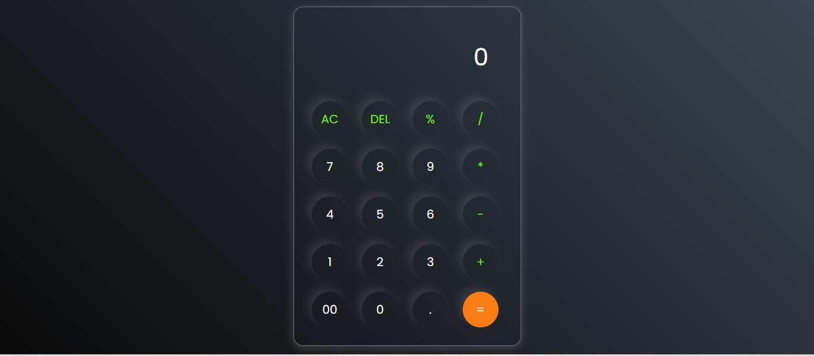

# Hi, I'm Harsh Mishra! 👋

## 🚀 I'm a full-stack developer...

## Project Title - 
### 🧮 Calculator Website

A simple and responsive calculator built using HTML, CSS, and JavaScript. This project performs basic arithmetic operations like addition, subtraction, multiplication, and division.

## Features

+ Perform basic arithmetic operations (add, subtract, multiply, divide)

+ Clear and delete functionality

+ Responsive design for all screen sizes

+ Keyboard input support (optional, if implemented)

+ User-friendly interface

## Average time to complete
#### 2 hrs

## 🛠️ Built With

## 🛠 Skills
HTML, CSS, JS

## Demo | Netlify
https://capable-donut-893561.netlify.app/

## Screenshots

## 🤝 Contributing

Contributions are welcome! If you'd like to improve this project, feel free to submit a pull request or open an issue for discussion.

## 📫 Contact
For any questions or feedback, reach out via:

**Name:** Harsh Mishra

**GitHub:** HarshMishra23

**Email:** harshmishra0068@gmail.com
